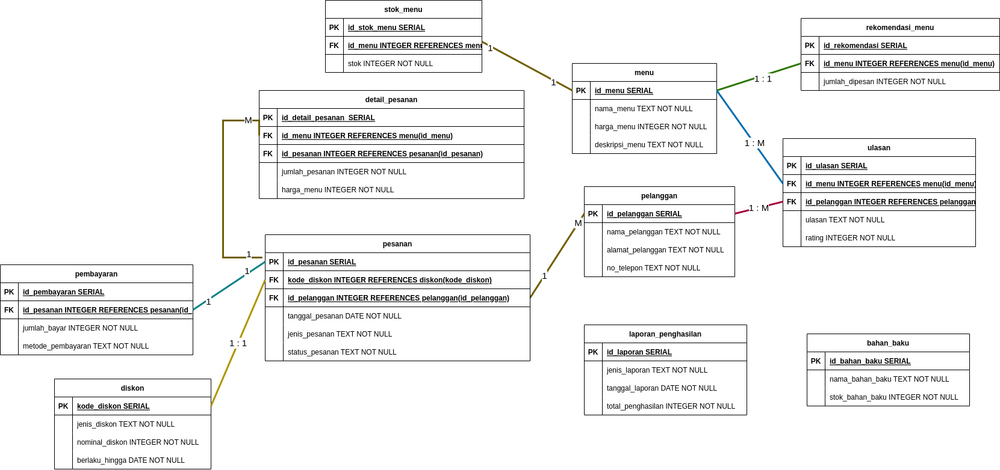

# Jawaban

# 1. Soal teori
Rancangkanlah diagram database untuk aplikasi rumah makan.
Kebutuhan:
1. Aplikasi ini bisa memasukkan pesanan-pesanan makanan pelanggan
2. Aplikasi ini bisa mengeluarkan struk pembelian
3. Aplikasi ini bisa mengeluarkan laporan penghasilan mingguan dan bulanan
4. Aplikasi ini bisa mengeluarkan laporan stok

Selain ini, saya juga mengusulkan fitur lainnya yaitu:   
5. Adanya aplikasi untuk customer sehingga bisa memesan makanan lewat mobile   
6. Dapat melakukan pembayaran melalui aplikasi    
7. Menambahkan fitur "pesanan untuk diambil" atau "pesanan antar" sehingga customer dapat memilih yang nyaman bagi mereka   
8. Aplikasi dapat memberikan rekomendasi menu, baik berdasarkan terpopuler maupun berdasarkan history pemesanan   
9. Aplikasi dapat memungkinkan pengguna untuk dapat memasukan kode diskon untuk pembayaran   
10. Menambahkan fitur ulasan atau penilaian makanan yang dipesan, sehingga restoran dapat memperbaiki layanan dan kualitas mereka   

Lalu dari sisi back office:   
11. Adanya aplikasi untuk manajemen stok bahan baku makanan yang akan dijual, sehingga memastikan ketersediaan bahan baku yang cukup   

Berikut adalah desain database yang saya [usulkan](https://drive.google.com/file/d/1kJD1irCyr9hmW5dFjYlzW7Lv4G9p2PpN/view?usp=sharing):   
 

Teknologi yang akan saya gunakan:
1. **Golang**, karena merupakan pemrograman yang open source dan memiliki kinerja yang baik dan mudah dikembangkan,sehingga cocok untuk aplikasi yang membutuhkan kecepatan dan skalabilitas
2. **NextJS**, adalah framework dari react yang memungkinkan developer untuk membuat aplikasi web lebih cepat dan responsif. Terlebih lagi Next.js memiliki fitur-fitur seperti server-side rendering, pre-rendering, dan static site generation yang dapat meningkatkan performa dan efisiensi aplikasi.
3. **Postgre**, adalah database relasional open source yang memiliki banyak fitur dan keamanan tinggi.
4. **Elasticsearch**, untuk mempercepat proses pencarian menu dan juga analisis data penjualan. Ini cocok digunakan ketika sistem yang dimilki sudah besar.
5. **Redis**, Digunakan untuk caching dan penyimpanan sementara, cocok digunakan untuk mempercepat data yang sering di akses seperti detail menu dan riwayat transaksi.

# 2. Soal Praktek

Ada di file main.go
